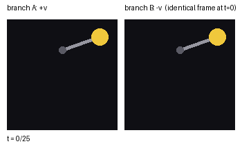
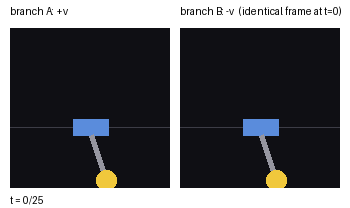
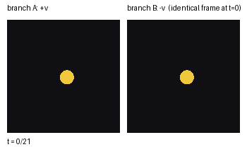
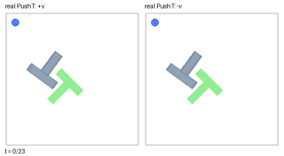
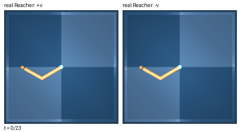
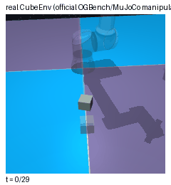
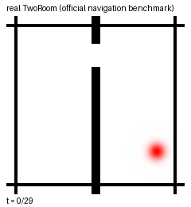

# TI-JEPA

A single camera frame can't tell you how fast something is moving. No motion
blur, no stroboscope, no speedometer overlay — just a snapshot of where
things are. That's obviously true for a photo. It's also quietly true for
every JEPA world model that trains an encoder to predict the *next frame's
embedding*, because that embedding is itself built from a single frame.

TI-JEPA is what happens if you take that seriously. We split the latent into
a pose code `q` (from one frame, same as everyone else) and an explicit
motion code `v` (a finite difference over a short window, fed through a
bias-free head so a frozen input provably decodes to zero velocity), and we
predict both. The predictor itself stays strictly memoryless — it never
sees more than the current `(q, v, action)` — so any improvement has to come
from the representation, not from secretly handing the model more context.

This repo has the environments, the three evaluation protocols, the model,
and the real-benchmark pipeline we used to check all of this.

## See it, don't just read about it

Same starting frame, opposite initial velocity, zero action from there on.
If a representation only carries position, there's no way to tell these two
rollouts apart from the first frame. The real physics disagrees:

<p align="center">
  <br>
  <sub>Pendulum — identical frame at t=0, diverging under the real dynamics.</sub>
</p>

<p align="center">
  <br>
  <sub>CartPole — same deal, more coupled dynamics.</sub>
</p>

<p align="center">
  <br>
  <sub>InertiaBall — the simplest case, free motion on a plane.</sub>
</p>

This is the live version of the "kill experiment" (Protocol B below) run
directly against each environment's real simulator — not a mockup. There's
a decoded version of the same experiment, with model rollouts overlaid, in
`results/pretty/`.

### The same thing on the real benchmarks

The toy environments above are built so velocity isn't optional. The real
question is whether the same blind spot shows up on benchmarks nobody built
for this paper. These four clips are the real official simulators — PushT
(pymunk), Reacher (dm_control/MuJoCo), Cube (OGBench/MuJoCo manipulation),
TwoRoom — rendered directly, no model involved:

<p align="center">
  <br>
  <sub>Real PushT — identical block config, opposite initial velocity, real pymunk physics forward.</sub>
</p>

<p align="center">
  <br>
  <sub>Real Reacher — identical joint config, opposite initial joint velocity, real MuJoCo physics forward.</sub>
</p>

PushT and Reacher both have real coasting dynamics, so the branch split
above is physically meaningful, and it's exactly the construction behind
every real-PushT/Reacher number in the probe-ladder and kill-experiment
tables. Cube and TwoRoom don't coast the same way — Cube's a torque-driven
manipulator and TwoRoom's action *is* a velocity, not a force — so instead
of forcing a branching story that doesn't fit, here's each one just running:

<p align="center">
  
  
</p>

All four are generated by `scripts/make_lewm_demo_gifs.py` against the
official `stable_worldmodel` environments — the same ones every real-PushT /
real-Reacher / probe-ladder number in this repo is measured on.

## What's actually in here

- **Three custom physics environments** (`ti_jepa/envs/`) — InertiaBall,
  Pendulum, CartPole — built specifically so velocity isn't optional:
  unactuated free motion, a gravity-restored pendulum, a coupled cart-pole.
  Same CNN backbone, same hyperparameter recipe, only physical constants
  differ.
- **TI-JEPA and a matched-budget baseline** (`ti_jepa/models.py`) — the
  baseline is the single-frame-target recipe everyone uses (SIGReg,
  history-conditioned predictor), built to be a fair opponent, not a straw
  man. There's also a from-scratch ViT-Tiny/14 + AdaLN-transformer path
  (`vit_backbone.py`, `official_predictor.py`) for official-architecture-scale
  runs, and a recurrent (GRU) predictor variant for the RSSM/Dreamer-style
  comparison.
- **RateIdent, three evaluation protocols** (`ti_jepa/eval/`):
  - *Probe ladder* — linear probes for velocity on single-frame / pair /
    window / explicit-`v` representations, episode-level train/test split.
  - *Kill experiment* — the thing in the GIFs above, quantified: branch
    separation and velocity-sign accuracy on a blind rollout.
  - *Inertial planning* — CEM-based stop-at-goal control, open- and
    closed-loop, against a cost that can't be satisfied without implicitly
    using velocity.
- **Real-benchmark evaluation** (`real_pusht/`, `real_reacher/`) — the same
  three protocols run against the officially released LeWM checkpoints
  (PushT, Reacher, Cube, TwoRoom, zero retraining) and against our own
  matched-budget models retrained on real PushT and dm_control Reacher
  pixels, including an official-scale run on real Reacher photographs
  trained entirely from scratch.
- **Figure and demo generation** (`scripts/`) — everything used to make the
  figures in `results/`, including `make_demo_gifs.py` for the GIFs above.

## Numbers, not vibes

A few that stuck with us while running this:

- On the four official LeWM checkpoints (PushT, Reacher, Cube, TwoRoom), every
  linear velocity probe — single frame, pair, or the full 3-frame window —
  sits at or below its own shuffled-label chance floor, while position
  decoding on the same embeddings reaches R² ≈ 0.94–0.98. Same encoder,
  same frozen weights, two very different outcomes depending on what you ask it.
- TI-JEPA's stop-at-goal planning beats a matched-memory baseline by 55%
  lower final distance on Pendulum (p = 3.2×10⁻¹⁰) and 64% lower on CartPole
  (p = 5.1×10⁻¹⁵), closed-loop.
- Pushed onto real dm_control Reacher photographs, trained from scratch at
  official ViT-Tiny + AdaLN scale: TI-JEPA's kill-experiment branch
  separation beats the memory-having baseline's by roughly 38×.
- Against a same-footprint recurrent (GRU) aggregator: ties or loses
  slightly on the two environments with near-independent coordinates, then
  wins outright on CartPole — the one environment where the two physical
  quantities are hardest to disentangle, which is exactly where an explicit
  pose/motion split should matter most.
- Switching the CartPole encoder from a 4-layer CNN to ViT-Tiny/14 takes the
  explicit velocity probe from r = 0.30 to r = 0.91. The small backbone
  wasn't wrong about the mechanism, it just didn't have the resolution to
  read it out linearly.

## Quickstart

```bash
pip install -r requirements.txt
```

Train all three arms on CartPole and run all three protocols:

```bash
python3 -m ti_jepa.train --env cartpole --model baseline --k 3 --steps 8000 \
  --out checkpoints/cartpole/baseline_k3.pt --seed 1
python3 -m ti_jepa.train --env cartpole --model baseline --k 1 --steps 8000 \
  --out checkpoints/cartpole/baseline_k1.pt --seed 1
python3 -m ti_jepa.train --env cartpole --model tijepa --k 3 --steps 8000 \
  --out checkpoints/cartpole/tijepa.pt --seed 1

python3 -m ti_jepa.eval.probe_ladder --env cartpole \
  --baseline_ckpt checkpoints/cartpole/baseline_k3.pt \
  --tijepa_ckpt checkpoints/cartpole/tijepa.pt \
  --out results/probe_ladder_cartpole.json

python3 -m ti_jepa.eval.kill_experiment --env cartpole \
  --baseline_ckpt checkpoints/cartpole/baseline_k3.pt \
  --baseline_k1_ckpt checkpoints/cartpole/baseline_k1.pt \
  --tijepa_ckpt checkpoints/cartpole/tijepa.pt \
  --n_pairs 200 --horizon 15 \
  --out_json results/kill_experiment_cartpole.json \
  --out_fig results/kill_experiment_cartpole.png

python3 -m ti_jepa.eval.planning --env cartpole \
  --baseline_ckpt checkpoints/cartpole/baseline_k3.pt \
  --tijepa_ckpt checkpoints/cartpole/tijepa.pt
```

Pretrained checkpoints for every arm — small-CNN and official ViT-Tiny +
AdaLN scale, all three environments, two seeds — are on the Hugging Face Hub:
[**TingheOliver/TI-JEPA-checkpoints**](https://huggingface.co/TingheOliver/TI-JEPA-checkpoints).

Want the official-scale (ViT-Tiny/14 + AdaLN transformer) pipeline end to
end, with the validated hyperparameter recipe baked in? That's
`scripts/run_official_scale_cartpole.sh` / `run_official_scale_pendulum.sh`.

For the real-benchmark scripts (`real_pusht/`, `real_reacher/`), you'll
need the official LeWM repo and its benchmark datasets, pointed to via a
couple of environment variables — see the top of `README` in those folders'
scripts, or just grep for `os.environ.get` to see what each one expects.

## Repo layout

```
ti_jepa/
  envs/            InertiaBall, Pendulum, CartPole
  models.py        LeWMStyleEncoder/HistoryPredictor, TIJEPAEncoder/TIJEPAPredictor, RecurrentPredictor
  vit_backbone.py  Official-scale ViT-Tiny/14 encoder
  official_predictor.py   AdaLN-conditioned transformer predictor
  sigreg.py        SIGReg regularizer
  data.py          Episode generation + windowed dataset
  train.py         Training entry point
  eval/            probe_ladder.py, kill_experiment.py, planning.py

scripts/           Figure generation, demo GIFs, official-scale run scripts
real_pusht/        Official PushT/Reacher checkpoint eval + matched-budget retraining
real_reacher/      Standalone real dm_control Reacher helpers
results/           Figures, GIFs, and raw numeric results referenced above
```

## License

MIT. See `LICENSE`.
